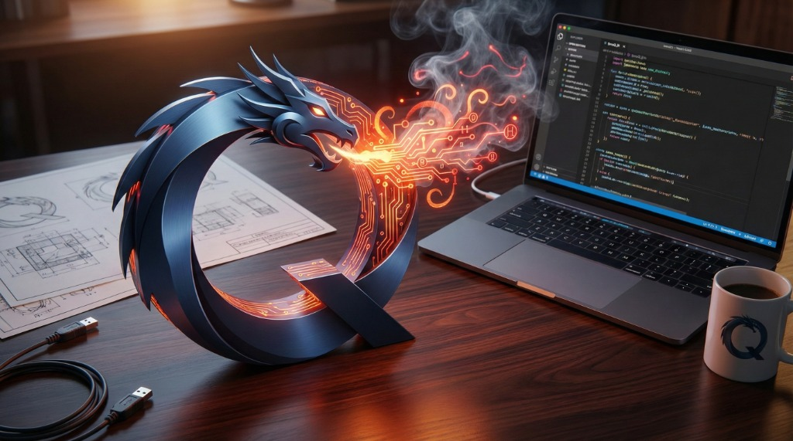

<p align="center">
  
</p>

<p align="center">
  <h1 align="center">SmoQ.jl</h1>
  <p align="center"><strong>Matrix-Free Quantum Simulator in Julia</strong></p>
</p>

---

**SmoQ.jl** is a Julia package for simulating **pure states and mixed states** without constructing explicit operator matrices. It handles both closed and open quantum systems using bitwise operations on state amplitudes.

> **Educational Purpose**  
> This library is designed primarily for **educational and research purposes** — it is ideal for learning how to build a quantum simulator from scratch, and for running numerical experiments in quantum information science. Pure state dynamics can be simulated for **N = 24–26 qubits** in reasonable time on a laptop with moderate CPU and RAM.

We provide a comprehensive set of **numerical experiments** spanning:

|             Category              |                                            Topics                                             |
| --------------------------------- | --------------------------------------------------------------------------------------------- |
| **Quantum Information Protocols** | Teleportation, entanglement swapping, Bell states, CHSH inequality                            |
| **Many-Body Quantum Dynamics**    | Spin chain evolution, Heisenberg/XXZ/TFIM models, OAT squeezing                               |
| **Open Quantum Systems**          | Lindbladian dynamics, DM vs MCWF, noise channels (depolarizing, dephasing, amplitude damping) |
| **Variational Quantum Circuits**  | VQE, quantum autoencoders, parametrized gates, optimizer benchmarks (SPSA, Adam)              |
| **Quantum Metrology**             | Quantum Fisher Information, spin squeezing, Heisenberg scaling                                |
| **Classical Shadows**             | Randomized measurements, observable estimation, state tomography                              |
| **Stabilizer Rényi Entropy**      | Magic quantification, brute-force and Fast Walsh-Hadamard Transform (FWHT) algorithms         |

All experiments are provided as ready-to-run demo scripts in the `scripts/` directory.

Main capabilities:

- Hamiltonian time evolution (Trotter, Chebyshev, exact)
- Parametrized quantum circuits with noise
- Density matrix and Monte Carlo Wave Function (MCWF) representations
- Noise channels (depolarizing, dephasing, amplitude damping)
- Quantum Fisher Information and spin squeezing
- Variational optimization (VQE, quantum autoencoders)

> **SmoQ** — from Polish *"Smok"* (pronounced "smock"), meaning *dragon*. In Polish legend, the [Dragon of Wawel Hill](https://en.wikipedia.org/wiki/Wawel_Dragon) (*Smok Wawelski*) made its home under Wawel Castle.

---

## Matrix-Free Bitwise Architecture

**SmoQ never constructs operator matrices.** All gates, observables, and correlators are computed directly on state amplitudes using fast bitwise index manipulation. This matrix-free approach is the key to reaching **N = 26–28 qubits** in full statevector simulation on standard hardware (laptop with 32–64 GB RAM).

```
Gate on qubit k:    Flip bit k in index, mix corresponding amplitude pairs
Observable ⟨Z⟩:     Sum |ψᵢ|² weighted by sign(bit_k(i))
Correlator ⟨XX⟩:    Process amplitude quartets via XOR bit patterns

Memory scaling:     O(2^N) for pure states     → N=26: ~1 GB, N=28: ~4 GB
                    O(4^N) for density matrices → N=13: ~1 GB
                    O(2^N) for MCWF trajectories (open systems at pure-state cost)
```

**Key optimizations:**
- **No matrix allocation**: Gates act in-place on amplitude pairs identified by bit flips
- **Cache-friendly access**: Operations process contiguous memory blocks where possible
- **Multithreading**: Embarrassingly parallel amplitude updates via `@threads`
- **Bitwise XOR patterns**: Fast qubit indexing for multi-qubit gates and correlators

### Monte Carlo Wave Function for Open Systems

For dissipative dynamics, SmoQ supports two complementary approaches:

1. **Density Matrix (DM)**: Evolve the full ρ matrix — exact but O(4^N) memory
2. **Monte Carlo Wave Function (MCWF)**: Evolve pure state trajectories with stochastic quantum jumps — O(2^N) memory per trajectory

MCWF allows simulation of **open quantum systems at the same memory cost as closed systems**, making it possible to study dissipation and decoherence in larger systems.

---

## Features

Simulator for digital and analog quantum computing written in Julia with matrix-free implementation for operators, observables, and gates. Supports open and closed quantum systems, unitary and Lindbladian dynamics, and noisy quantum circuits. Open systems can be simulated via density matrices or Monte Carlo wave function (MCWF) trajectories. Focus on quantum information, quantum metrology, and quantum simulation. See `scripts/*/demo_*.jl` for examples.

<p align="center">
  
</p>

### State Representations
- **Pure states** |ψ⟩ ∈ ℂ^(2^N) — state vector
- **Mixed states** ρ ∈ ℂ^(2^N × 2^N) — density matrix (exact)
- **Stochastic trajectories** — MCWF for mixed states without storing ρ

### Quantum Operations (All Matrix-Free)
|        Category        |                          Operations                          |
| ---------------------- | ------------------------------------------------------------ |
| **Single-qubit gates** | Rx, Ry, Rz, H, X, Y, Z, S, T, S†, T†                         |
| **Two-qubit gates**    | CZ, CNOT, SWAP, Rxx, Ryy, Rzz                                |
| **Observables**        | Pauli strings, in particular ⟨X⟩, ⟨Y⟩, ⟨Z⟩, ⟨XX⟩, ⟨YY⟩, ⟨ZZ⟩ |
| **Noise channels**     | Depolarizing, dephasing, amplitude damping, bit/phase flip   |
| **Measurements**       | Projective (X, Y, Z basis), reset, state collapse            |

### Time Evolution (Analog Simulation)
- **Trotter decomposition** — matrix-free gate sequences for local Hamiltonians
- **Chebyshev polynomials** — high-accuracy evolution without Trotter error
- **Exact diagonalization** — for small systems requiring exact dynamics

### Variational Quantum Circuits (Digital Simulation)
- **Ansätze** — Hardware-efficient, strongly-entangling, custom
- **Optimizers** — SPSA (gradient-free), Adam, gradient descent
- **Automatic differentiation** — Enzyme.jl available if needed
- **Noisy circuits** — Add decoherence to any circuit via DM or MCWF
- **Applications** — VQE, quantum autoencoders

### Quantum Information & Metrology
- **Quantum Fisher Information (QFI)** via symmetric logarithmic derivative
- **Spin squeezing** — Wineland parameter ξ²
- **State characterization** — Purity, von Neumann entropy, fidelity, trace distance
- **Partial trace** — Reduced density matrices for subsystems

### Classical Shadows (Quantum State Tomography)
Randomized measurement protocol for efficient estimation of quantum state properties:
- **Shadow collection** — Random Pauli basis measurements with classical post-processing
- **Density matrix reconstruction** — Full tomographic reconstruction from shadow snapshots
- **Observable estimation** — Direct estimation of ⟨X⟩, ⟨Y⟩, ⟨Z⟩ and correlators ⟨X_i X_{i+1}⟩
- **Mixed state support** — Works with both pure and noisy/depolarized states
- **Sample complexity** — Accurate estimation with O(log N) measurements for local observables

---

## Installation

```julia
using Pkg
Pkg.add(url="https://github.com/MarcinPlodzien/SmoQ.jl")
```

### Dependencies

Main packages used:
- **LinearAlgebra**, **SparseArrays** — core linear algebra
- **Plots** — visualization
- **Optimisers** — Adam optimizer
- **Enzyme** — automatic differentiation (optional)
- **Krylov**, **KrylovKit** — iterative solvers
- **ExponentialUtilities** — matrix exponentials
- **OrdinaryDiffEq** — ODE integration
- **ProgressMeter** — progress bars

All dependencies are listed in `Project.toml` and installed automatically.

---

## Quickstart

Create a GHZ state, add noise, and measure Quantum Fisher Information in ~15 lines:

```julia
using SmoQ

# 1. Prepare 6-qubit GHZ state: |000000⟩ + |111111⟩
N = 6
ψ = zeros(ComplexF64, 2^N); ψ[1] = 1.0  # |000000⟩
apply_hadamard!(ψ, 1, N)                 # H on qubit 1
for k in 2:N
    apply_cnot!(ψ, 1, k, N)              # CNOT cascade
end

# 2. Verify GHZ correlations
println("⟨Z₁Z₂⟩ = ", expectation_ZZ(ψ, 1, 2, N))  # Should be +1

# 3. Add depolarizing noise (p = 0.05)
ρ = apply_depolarizing_channel(ψ, 0.05, N)

# 4. Compute Quantum Fisher Information
generator = sum_of_paulis(:Z, N)  # ∑ᵢ Zᵢ
F_Q = quantum_fisher_information(ρ, generator, N)
println("QFI/N^2 = ", F_Q / N^2)   # Heisenberg scaling: ~1 for pure GHZ
```

### Running Demo Scripts

```bash
# From the SmoQ.jl directory, run any demo with multithreading:
julia --threads=auto --project=. scripts/quantum_information/demo_quantum_info_protocols.jl

# Or specify thread count explicitly:
julia --threads=8 --project=. scripts/quantum_simulations/demo_one_axis_twisting.jl

# The --project=. flag loads dependencies from Project.toml
```

---

## Library Architecture

```
SmoQ.jl/
├── assets/                           # Logo, images
├── docs/                             # Documentation         
├── Project.toml                      # Dependencies 
├── scripts
│   ├── quantum_information/          # Bell states, shadows, metrology, entropy
│   ├── quantum_simulations/          # Time evolution, Lindbladian, channels
│   └── variational_quantum_circuits/ # VQE, autoencoders, optimizers
├── SmoQ.jl_benchmarks/               # Benchmarks against other solvers
├── src
│   ├── cpu/                         # Core simulation modules (32 files) 
│   ├── helpers/                     # Utility functions and data structures
│   └── SmoQ.jl                      # Package module
└── test/                            # Package tests
```

### Core Modules (`utils/cpu/`)

|        Category         |                                 Modules                                  |                        Description                         |
| ----------------------- | ------------------------------------------------------------------------ | ---------------------------------------------------------- |
| **State Preparation**   | `cpuQuantumStatePreparation.jl`                                          | GHZ, W, Bell, Dicke, cluster, computational basis          |
| **Gates & Observables** | `cpuQuantumChannelGates.jl`, `cpuQuantumStateObservables.jl`             | All single/two-qubit gates, Pauli expectations             |
| **Measurements**        | `cpuQuantumStateMeasurements.jl`, `cpuQuantumStatePartialTrace.jl`       | Projective measurements, partial trace, tomography         |
| **Noise Channels**      | `cpuQuantumChannelKrausOperators.jl`                                     | Depolarizing, dephasing, amplitude damping, bit/phase flip |
| **Unitary Evolution**   | `cpuQuantumChannelUnitaryEvolution{Trotter,Chebyshev,Exact}.jl`          | Three integrators for Hamiltonian dynamics                 |
| **Lindbladian**         | `cpuQuantumChannelLindbladianEvolution{DM,MCWF}.jl`                      | Open system dynamics: density matrix or trajectories       |
| **Hamiltonians**        | `cpuHamiltonianBuilder.jl`                                               | Heisenberg, XXZ, TFIM, OAT, custom Hamiltonians            |
| **VQC**                 | `cpuVariationalQuantumCircuit{Builder,Executor,Gradients,Optimizers}.jl` | Parametrized circuits, SPSA, Adam, parameter-shift         |
| **Metrology**           | `cpuQuantumFisherInformation.jl`, `cpuQuantumStateCharacteristic.jl`     | QFI, entropy, purity, fidelity, trace distance             |
| **Shadows**             | `cpuClassicalShadows.jl`                                                 | Pauli/Clifford shadows, observable estimation              |
| **Bell Correlators**    | `cpuQuantumStateManyBodyBellCorrelator.jl`                               | Q_ent, Q_bell entanglement witnesses                       |
| **Autodiff**            | `cpuVQCEnzymeWrapper.jl`                                                 | Enzyme.jl integration for analytic gradients               |

---

# User Guide

## 1. Pure State Simulation (Closed Systems)

### State Preparation

```julia
using SmoQ

N = 16  # qubits

# Computational basis states
ψ = make_ket("|0>", N)         # |00...0⟩
ψ = make_ket("|+>", N)         # |++...+⟩ = (|0⟩+|1⟩)^⊗N / 2^(N/2)
ψ = make_ket("|01+-0>")        # Per-qubit specification

# Entangled states
ψ_ghz = make_ghz(N)            # (|00...0⟩ + |11...1⟩)/√2
ψ_w = make_w(N)                # W state with single excitation
ψ_bell = make_bell(:phi_plus)  # Bell pair (|00⟩ + |11⟩)/√2
ψ_cluster = make_cluster(N)    # 1D cluster state
```

### Matrix-Free Gate Application

All gates operate **in-place** on the state vector without constructing matrices:

```julia
# Single-qubit rotations (no Ry matrix constructed)
apply_rx_psi!(ψ, qubit, θ, N)
apply_ry_psi!(ψ, qubit, θ, N)
apply_rz_psi!(ψ, qubit, θ, N)

# Clifford gates
apply_hadamard_psi!(ψ, qubit, N)
apply_pauli_x_psi!(ψ, qubit, N)
apply_pauli_y_psi!(ψ, qubit, N)
apply_pauli_z_psi!(ψ, qubit, N)

# Two-qubit entangling gates (no 4×4 or 2^N×2^N matrices)
apply_cz_psi!(ψ, q1, q2, N)
apply_cnot_psi!(ψ, control, target, N)
apply_rzz_psi!(ψ, q1, q2, θ, N)
```

### Bitwise Observable Computation

Expectation values computed directly from amplitudes — no operator matrices:

```julia
# Single-qubit observables
⟨Z⟩ = expect_local(ψ, qubit, N, :z)
⟨X⟩ = expect_local(ψ, qubit, N, :x)
⟨Y⟩ = expect_local(ψ, qubit, N, :y)

# Two-body correlators
⟨ZZ⟩ = expect_corr(ψ, q1, q2, N, :zz)
⟨XX⟩ = expect_corr(ψ, q1, q2, N, :xx)
⟨YY⟩ = expect_corr(ψ, q1, q2, N, :yy)
```

---

## 2. Analog Quantum Simulation (Time Evolution)

For Hamiltonian evolution |ψ(t)⟩ = exp(-iHt)|ψ(0)⟩:

### Trotter Decomposition (Matrix-Free)

```julia
using SmoQ.CPUQuantumChannelUnitaryEvolutionTrotter

# Define local Hamiltonian (e.g., Heisenberg chain)
H_params = HamiltonianParameters(
    N_x = N, N_y = 1,
    Jx = 1.0, Jy = 1.0, Jz = 1.0,  # Exchange couplings
    hx = 0.5                        # Transverse field
)

dt = 0.01
gates = precompute_trotter_gates_bitwise_cpu(H_params, dt)

# Evolve — no exp(-iHt) matrix constructed!
for step in 1:n_steps
    evolve_trotter_psi_cpu!(ψ, gates, N)
end
```

### Chebyshev Expansion

For high-accuracy evolution without Trotter error:

```julia
using SmoQ.CPUQuantumChannelUnitaryEvolutionChebyshev

ψ_evolved = evolve_chebyshev_psi_cpu(ψ, H_params, t, N; order=50)
```

---

## 3. Open Quantum Systems (Dissipative Dynamics)

### Lindbladian Master Equation

For systems coupled to an environment:

$$\frac{d\rho}{dt} = -i[H,\rho] + \sum_j \gamma_j \left( L_j \rho L_j^\dagger - \frac{1}{2}\{L_j^\dagger L_j, \rho\} \right)$$

### Approach 1: Density Matrix (Exact)

Full ρ evolution — exact but requires O(4^N) memory:

```julia
using SmoQ.CPUQuantumChannelLindbladianEvolution

jump_ops = [
    create_jump_operator(:sigma_minus, qubit=1, γ=0.1),  # Decay
    create_jump_operator(:dephasing, qubit=2, γ=0.05),   # Dephasing
]

evolver = create_lindbladian_evolver(H_params, dt, jump_ops)

for step in 1:n_steps
    lindbladian_evolve_dm!(ρ, evolver)
end
```

### Approach 2: Monte Carlo Wave Function (Scalable)

Stochastic trajectories with O(2^N) memory per trajectory — enables open system simulation at the same memory cost as pure state evolution:

```julia
# Single trajectory with quantum jumps
lindbladian_evolve_mcwf!(ψ, evolver)

# Ensemble average recovers density matrix physics
n_trajectories = 1000
ρ_ensemble = zeros(ComplexF64, dim, dim)
for traj in 1:n_trajectories
    ψ_traj = copy(ψ_init)
    for step in 1:n_steps
        lindbladian_evolve_mcwf!(ψ_traj, evolver)
    end
    ρ_ensemble .+= ψ_traj * ψ_traj'
end
ρ_ensemble ./= n_trajectories
```

### Noise Channels

Apply decoherence via Kraus operators (works for both DM and MCWF):

```julia
using SmoQ.CPUQuantumChannelKrausOperators

# Depolarizing: ρ → (1-p)ρ + (p/3)(XρX + YρY + ZρZ)
apply_channel_depolarizing!(state, p, qubits, N)

# Dephasing (T2): coherences decay
apply_channel_dephasing!(state, p, qubits, N)

# Amplitude damping (T1): excited state decays to ground
apply_channel_amplitude_damping!(state, γ, qubits, N)

# Bit/phase flip errors
apply_channel_bit_flip!(state, p, qubits, N)
apply_channel_phase_flip!(state, p, qubits, N)
```

### Projective Measurements

Bitwise projective measurements with state collapse:

```julia
using SmoQ.CPUQuantumStateMeasurements

# Measure single qubit in Z-basis (collapses state)
outcome, ψ = projective_measurement!(ψ, [qubit], :z, N)

# Measure multiple qubits in X-basis
outcomes, ψ = projective_measurement!(ψ, [1, 3, 5], :x, N)

# Measure in Y-basis
outcomes, ψ = projective_measurement!(ψ, [2, 4], :y, N)

# Fast: measure ALL qubits in Z-basis simultaneously
bitstring, ψ = projective_measurement_all!(ψ, N)

# Reset qubits to specific states (breaks entanglement)
reset_state!(ψ, [1, 2], [:zero, :plus], N)  # q1→|0⟩, q2→|+⟩
reset_state!(ψ, :zero, N)                    # Reset all to |0⟩
```

### Random Unitaries and Brick-Wall Circuits

Haar-random unitaries and scrambling circuits:

```julia
using SmoQ.CPUQuantumChannelRandomUnitaries

# Generate Haar-random unitary (up to ~10 qubits practical)
U_1q = random_unitary(1)   # 2×2 random unitary
U_2q = random_unitary(2)   # 4×4 random unitary

# Apply arbitrary 2-qubit gate (matrix-free)
apply_2qubit_gate!(ψ, U_2q, q1, q2, N)

# Brick-wall circuit for scrambling/thermalization studies
gates_even = [random_unitary(2) for _ in 1:N÷2]
gates_odd = [random_unitary(2) for _ in 1:(N÷2 - 1)]
apply_brickwall_layer!(ψ, gates_even, gates_odd, N)

# Full-depth brick-wall circuit
apply_brickwall!(ψ, depth, gates_even, gates_odd, N)
```

---

### Built-in Hamiltonians

Several test Hamiltonians are implemented for 1D chains and ladder/grid geometries:

```julia
using SmoQ.CPUHamiltonianBuilder

# Pre-defined Hamiltonian types
# :heisenberg    - Heisenberg XXX with transverse field
# :TFIM_ZZ_X     - Transverse-field Ising model  
# :XX_X          - XX model with transverse field

# Build Hamiltonian parameters
H_params = build_hamiltonian_parameters(Nx, Ny, :heisenberg; J=1.0, h=0.5)

# For chain geometry (Ny=1)
H_chain = build_hamiltonian_parameters(L, 1, :TFIM_ZZ_X; J=1.0, h=1.0)
```

### One-Axis Twisting and Spin Squeezing

A demonstration script for One-Axis Twisting (OAT) dynamics is included, showcasing spin squeezing generation and QFI scaling:

```julia
# Run OAT simulation (see scripts/quantum_simulations/demo_one_axis_twisting.jl)
# Evolves under H_OAT = χ Jz² and tracks:
# - Spin squeezing ξ²(t)
# - Quantum Fisher Information F_Q(t)
# - Metrological gain F_Q/N → Heisenberg scaling

# Typical results for N=20 spins:
# - Squeezing reaches ξ² ≈ 0.1 (-10 dB)
# - QFI/N² approaches 1 (Heisenberg limit)
```

---

## 4. Digital Quantum Circuits (Pure and Noisy)

SmoQ supports simulation of both ideal and noisy quantum circuits. Noise can be incorporated using either exact density matrix evolution or scalable Monte Carlo Wave Function (MCWF) trajectories.

### Supported Noise Models

The following noise channels are available for noisy circuit simulation:

|        Channel        |          Physical Process           |                Effect on State                |        |                                  |
| --------------------- | ----------------------------------- | --------------------------------------------- | ------ | -------------------------------- |
| **Depolarizing**      | Uniform random errors               | ρ → (1-p)ρ + (p/3)(XρX + YρY + ZρZ)           |        |                                  |
| **Dephasing**         | T₂ decay, phase randomization       | Off-diagonal elements decay: ρ₀₁ → √(1-p)·ρ₀₁ |        |                                  |
| **Amplitude Damping** | T₁ relaxation, spontaneous emission | \                                             | 1⟩ → \ | 0⟩ with rate γ, coherences decay |
| **Bit Flip**          | Classical bit error                 | X applied with probability p                  |        |                                  |
| **Phase Flip**        | Phase error                         | Z applied with probability p                  |        |                                  |

All noise channels work with both density matrices (exact) and state vectors (MCWF stochastic sampling).

### Building Circuits

```julia
using SmoQ.CPUVariationalQuantumCircuitBuilder

# Hardware-efficient ansatz
circuit = hardware_efficient_ansatz(N, n_layers=4,
    rotations=[:ry, :rz],
    entangler=:cz,
    topology=:chain
)

# Custom circuit with noise layers
ops = [
    gate(:ry, [1], param_idx=1),
    gate(:ry, [2], param_idx=2),
    gate(:cz, [1, 2]),
    noise(:depolarizing, [1, 2], p=0.01),  # Depolarizing after entangling
    gate(:rz, [1], param_idx=3),
    noise(:dephasing, [1], p=0.005),       # T2 decay
    measure([1, 2], basis=:z),
]
circuit = ParameterizedCircuit(N, ops)
```

### Pure Circuit Execution

For ideal (noise-free) circuits:

```julia
θ = randn(circuit.n_params) * 0.1
ψ_final = execute_circuit(circuit, θ)
```

### Noisy Circuit Execution with MCWF

For circuits with decoherence, two approaches are available:

```julia
# Approach 1: Density matrix (exact, O(4^N) memory)
ρ_final = execute_circuit_dm(circuit, θ)

# Approach 2: MCWF trajectories (scalable, O(2^N) memory per trajectory)
# Stochastic sampling of noise effects
n_trajectories = 1000
ρ_avg = zeros(ComplexF64, dim, dim)
for traj in 1:n_trajectories
    ψ = execute_circuit_mcwf(circuit, θ)  # Random quantum jumps
    ρ_avg .+= ψ * ψ'
end
ρ_avg ./= n_trajectories  # Ensemble average recovers mixed state physics
```

MCWF enables simulation of noisy circuits for larger qubit counts by avoiding explicit density matrix storage.

### Variational Quantum Circuit Training

Training variational quantum circuits presents unique challenges. Traditional optimizers like Adam require exact gradients (via backpropagation or parameter-shift), which become computationally expensive in the presence of shot noise from MCWF trajectories. SmoQ addresses this with a combination of gradient-free and gradient-based methods.

---

#### Hybrid Adam+SPSA Optimization

SmoQ features a specialized **Adam+SPSA** optimizer designed for noisy, high-dimensional variational landscapes:

**Why Hybrid?**

| Challenge | Solution |
|-----------|----------|
| **Gradient bottleneck**: Exact AD can trigger memory overhead in matrix-free simulation | SPSA approximates gradients with only 2 function evaluations |
| **Noisy landscapes**: MCWF cost functions "shimmer" due to quantum jumps | Adam's momentum filters out stochastic noise |
| **High dimensionality**: Parameter-shift requires O(p) evaluations | SPSA is O(1) regardless of parameter count |

**The Approach:**

1. **SPSA** estimates the gradient using simultaneous random perturbations:
   ```
   g_k ≈ [f(θ + c_k·Δ) - f(θ - c_k·Δ)] / (2·c_k·Δ)
   ```
   where Δ is a random direction vector (±1 for each component)

2. **Adam** smooths the noisy SPSA gradient using momentum:
   - First moment (mean): keeps optimizer moving consistently
   - Second moment (variance): scales learning rate per-parameter

**Result:** The speed and low memory of SPSA combined with the smooth, reliable convergence of Adam.

| Feature | Vanilla SPSA | Exact Gradient | **Adam+SPSA** |
|---------|-------------|----------------|---------------|
| Evaluations per step | 2 | O(p) | **2** |
| Noise robustness | High | Low | **Very High** |
| Convergence | Slow/jittery | Fast | **Fast & Smooth** |
| Memory cost | Minimal | High (AD) | **Minimal** |

---

#### SPSA Optimizer

Gradient-free optimization suitable for noisy cost functions:

```julia
using SmoQ.CPUVariationalQuantumCircuitOptimizers

cost(θ) = compute_energy(execute_circuit(circuit, θ), H_params)

opt = SPSAOptimizer(
    a = 0.1,      # Initial step size
    c = 0.1,      # Initial perturbation magnitude
    A = 10.0,     # Stability constant
    α = 0.602,    # Step decay exponent
    γ = 0.101     # Perturbation decay exponent
)

θ_opt, history = optimize!(cost, θ_init, opt; max_iter=200)
```

---

#### Adam Optimizer

Momentum-based gradient optimizer with adaptive learning rates:

```julia
opt = AdamOptimizer(
    lr = 0.01,    # Learning rate
    β1 = 0.9,     # First moment decay
    β2 = 0.999,   # Second moment decay
)

θ_opt, history = optimize!(cost, θ_init, opt; grad_fn=grad_fn, max_iter=500)
```

---

#### Automatic Differentiation with Enzyme

SmoQ uses **Enzyme.jl** for efficient automatic differentiation of quantum circuits. Enzyme operates at the LLVM level, providing near-optimal gradient computation without the overhead of tape-based AD systems:

```julia
using SmoQ.CPUVQCEnzymeWrapper

# Compute gradients via Enzyme AD
gradients = compute_gradients_enzyme(circuit, θ, cost_fn)

# Use with Adam optimizer
θ_opt, history = optimize!(cost, θ_init, AdamOptimizer(lr=0.01);
    grad_fn = θ -> compute_gradients_enzyme(circuit, θ, cost),
    max_iter = 500
)
```

Enzyme is particularly effective for the matrix-free operations in SmoQ, as it can differentiate through the bitwise gate implementations directly.

---

#### Additional Optimizers

```julia
# Gradient descent with learning rate decay
opt = GradientDescentOptimizer(lr=0.05, decay=0.01)
θ_opt, history = optimize!(cost, θ_init, opt; grad_fn=grad_fn)
```

---

## 5. Quantum Information & Metrology

SmoQ provides comprehensive tools for quantum metrology, entanglement characterization, and correlation analysis.

### Quantum Fisher Information (QFI)

The Quantum Fisher Information quantifies the sensitivity of a quantum state to parameter changes, setting the ultimate precision limit for quantum sensing:

$$\Delta\theta \geq \frac{1}{\sqrt{F_Q}}$$

SmoQ computes QFI for arbitrary parameter encodings using matrix-free generator application:

```julia
using SmoQ.CPUQuantumFisherInformation

# QFI for parameter θ encoded via generator G = Σᵢ σᵢʸ
# State evolution: |ψ(θ)⟩ = exp(-iθG/2)|ψ(0)⟩
qfi = get_qfi(ψ, N, collect(1:N), :y)

# Supports X, Y, Z generators
qfi_x = get_qfi(ψ, N, [1, 2, 3], :x)  # Partial generator on qubits 1-3
qfi_z = get_qfi(ψ, N, collect(1:N), :z)

# Mixed state QFI via Symmetric Logarithmic Derivative (SLD)
qfi_mixed = get_qfi(ρ, N, collect(1:N), :y; method=:sld)
```

#### Fast Subsystem QFI via Schmidt Compression

For large systems, computing QFI of a subsystem is accelerated using Schmidt decomposition. This avoids constructing the full reduced density matrix:

```julia
# Subsystem QFI with Schmidt compression
# Compresses to the Schmidt rank before applying SLD formula
qfi_sub = get_qfi(ψ, N, collect(1:N), :y; subsystem_qubits=[1,2,3,4])
```

The Schmidt compression identifies the effective rank of the subsystem, reducing computation from O(2^N) to O(r²) where r is the Schmidt rank.

**Metrological Scaling:**
- Standard Quantum Limit (SQL): F_Q = N
- Heisenberg Limit: F_Q = N²
- Metrological gain: F_Q / N (values > 1 indicate quantum enhancement)

---

### Spin Squeezing

Spin squeezing characterizes metrologically useful entanglement in collective spin systems:

```julia
# Compute all collective spin observables in one pass
Jx, Jy, Jz, JxJx, JyJy, JzJz, JyJz = compute_observables(ψ, N)

# Wineland spin squeezing parameters
# ξ²_S: spectroscopic squeezing (variance reduction)
# ξ²_R: Ramsey squeezing (metrological gain)
ξ²_S, ξ²_R = compute_spin_squeezing(N, Jx, Jy, Jz, JyJy, JzJz, JyJz)

# Squeezing in dB
squeezing_dB = 10 * log10(ξ²_R)
# Negative values indicate squeezing below SQL
```

**Physical Interpretation:**
- ξ² < 1: State is squeezed (reduced variance in one spin component)
- ξ² < 1 implies entanglement (Sørensen-Mølmer criterion)
- Metrological gain: phase sensitivity improved by factor 1/ξ² over coherent states

---

### State Characterization

```julia
using SmoQ.CPUQuantumStateCharacteristic

# Purity: Tr(ρ²) ∈ [1/d, 1]
purity = get_purity(ρ)

# Von Neumann entropy: S = -Tr(ρ log ρ)
entropy = get_von_neumann_entropy(ρ)

# State fidelity: F(ρ, σ) = [Tr(√(√ρ σ √ρ))]²
fidelity = get_fidelity(ρ1, ρ2)

# Trace distance: D(ρ, σ) = ½ ||ρ - σ||₁
trace_dist = get_trace_distance(ρ1, ρ2)
```

---

### Partial Trace (Reduced States)

Compute reduced density matrices for subsystem analysis:

```julia
using SmoQ.CPUQuantumStatePartialTrace

# Trace out qubits to get reduced state
qubits_to_trace = [3, 4, 5]  # Trace out qubits 3, 4, 5
ρ_reduced = partial_trace(ρ, qubits_to_trace, N)

# Entanglement entropy of subsystem
S_ent = get_von_neumann_entropy(ρ_reduced)
```

---

## 6. Quantum Information Protocols

SmoQ supports mid-circuit measurements for quantum information protocols:

|       Protocol        |                             Key Functions                             |               Demo               |
| --------------------- | --------------------------------------------------------------------- | -------------------------------- |
| Teleportation         | `projective_measurement!`, `apply_pauli_x_psi!`, `apply_pauli_z_psi!` | `demo_quantum_info_protocols.jl` |
| Entanglement Swapping | `partial_trace`, `expect_corr`                                        | `demo_quantum_info_protocols.jl` |
| GHZ/Bell States       | `apply_hadamard_psi!`, `apply_cz_psi!`                                | `demo_quantum_info_protocols.jl` |
| CHSH Inequality       | `projective_measurement!`, measurement statistics                     | `demo_quantum_info_protocols.jl` |

See `scripts/quantum_information/demo_quantum_info_protocols.jl` for complete working examples.

---

## 7. Variational Quantum Eigensolver (VQE)

VQE finds ground states of spin Hamiltonians by variationally minimizing energy:

```
|0...0⟩ → [Ansatz U(θ)] → |ψ(θ)⟩ → minimize E(θ) = ⟨ψ(θ)|H|ψ(θ)⟩
```

### Hamiltonian Convention

**All positive signs in the formula** — coupling signs are explicit in parameters:

```julia
# H = Jxx∑XX + Jyy∑YY + Jzz∑ZZ + hx∑X
# Use negative J for antiferromagnetic coupling

HAMILTONIAN_CONFIGS = [
    # (name,   Jxx,  Jyy,  Jzz,  hx)
    ("XXZ",  -1.0, -1.0, -0.5, -1.0),  # Antiferromagnetic XXZ
    ("XY",   -1.0, -1.0,  0.0, -1.0),  # XY model
    ("TFIM",  0.0,  0.0, -1.0, -1.0),  # Transverse Field Ising
]
```

### Tracked Metrics (3×3 Grid)

|  Row  |                      Metrics                       |
| ----- | -------------------------------------------------- |
| **1** | Energy E(θ), Entropy Sᵥₙ, Fidelity F with exact GS |
| **2** | Local observables ⟨X⟩, ⟨Y⟩, ⟨Z⟩ per qubit          |
| **3** | Correlators ⟨XX⟩, ⟨YY⟩, ⟨ZZ⟩ per bond              |

### Key Components

| Component |                 Function                  |          Module          |
| --------- | ----------------------------------------- | ------------------------ |
| Ansatz    | `build_ansatz_spec(N, L, :hea)`           | VQE script               |
| Energy    | `compute_energy(ψ, N, Jxx, Jyy, Jzz, hx)` | VQE script               |
| Lanczos   | `ground_state_xxz(N, Jxx, Jyy, Jzz, hx)`  | `CPUQuantumStateLanczos` |
| Optimizer | SPSA + Adam hybrid                        | `Optimisers.jl`          |

### Optimizer: SPSA + Adam

The main optimizer is **SPSA + Adam** (Simultaneous Perturbation Stochastic Approximation with Adam momentum). SPSA estimates gradients using only 2 function evaluations per step, regardless of parameter count:

```
g_k ≈ [f(θ + c·Δ) - f(θ - c·Δ)] / (2c·Δ)
```

where Δ is a random perturbation vector. Adam smooths the noisy SPSA gradient with momentum.

**Reference**: J. C. Spall, "Multivariate stochastic approximation using a simultaneous perturbation gradient approximation," *IEEE Transactions on Automatic Control*, 37(3):332-341, 1992.

See `scripts/variational_quantum_circuits/demo_variational_quantum_eigensolver.jl` for full implementation.

---

## 8. Quantum Autoencoder (QAE)

Compress N-qubit states to (N-k)-qubit latent representation:

```
|ψ_in⟩ → [Encoder U(θ)] → [Trace/Measure k qubits] → [Decoder U†(θ)] → |ψ_out⟩
```

### Representations

|   Mode   |     Compression     | Memory |     Noise     |
| -------- | ------------------- | ------ | ------------- |
| **DM**   | Exact partial trace | O(4^N) | Deterministic |
| **MCWF** | Measure + reset     | O(2^N) | Stochastic    |

### Compressibility via Schmidt Rank

| State | Schmidt Rank |           Compressibility           |
| ----- | ------------ | ----------------------------------- |
| GHZ   | 2            | Highly compressible (2D subspace)   |
| W     | 2            | Compressible, robust to qubit loss  |
| Dicke | O(2^(N/2))   | Hard to compress (high-dimensional) |

> **Key Insight**: "Maximally entangled" ≠ "hardest to compress"!  
> GHZ has maximal correlations but lives in a 2D subspace.

See `scripts/variational_quantum_circuits/demo_quantum_autoencoder.jl` for DM vs MCWF comparison.

---

## Demo Scripts

The `scripts/*/` directories contain comprehensive numerical experiments organized by topic. Each demo is self-contained and produces output figures and data files.

### Simulation Overview

SmoQ provides a complete quantum simulation pipeline:

**1. State Preparation**
- Pure states: computational basis, GHZ, W, Bell pairs, Dicke, cluster states
- Mixed states: thermal, depolarized, or evolved under noise
- Random states: Haar-random unitaries, brick-wall scrambling

**2. Time Evolution**

|           Mode           |                       Description                        |
| ------------------------ | -------------------------------------------------------- |
| **Digital (gates)**      | Parametrized circuits: Rx, Ry, Rz, CNOT, CZ, etc.        |
| **Analog (Hamiltonian)** | Continuous evolution under H: Heisenberg, XXZ, TFIM, OAT |

**3. Open vs Closed Systems**

|        System         |  Representation   | Memory |          Method          |                   |
| --------------------- | ----------------- | ------ | ------------------------ | ----------------- |
| **Closed**            | Pure state \      | ψ⟩     | O(2^N)                   | Unitary evolution |
| **Open (exact)**      | Density matrix ρ  | O(4^N) | Lindblad master equation |                   |
| **Open (stochastic)** | MCWF trajectories | O(2^N) | Quantum jump unraveling  |                   |

**4. Time Integrators**

|  Integrator   |                     Use case                      |
| ------------- | ------------------------------------------------- |
| **Exact**     | Matrix exponential, reference accuracy            |
| **Trotter**   | Product formula decomposition, controllable error |
| **Chebyshev** | Polynomial expansion, good for long times         |

### Quantum Information Protocols (`demo_quantum_info_protocols.jl`)

Step-by-step demonstration of fundamental quantum protocols with gate-by-gate visualization:

- **Bell state preparation**: Create |Phi+> = (|00> + |11>)/sqrt(2), verify correlations (ZZ, XX), partial trace to maximally mixed state
- **GHZ state creation**: N-qubit GHZ via H+CNOT cascade, verify all pairwise ZZ correlations = +1, genuinely tripartite entanglement
- **Noisy GHZ sampling**: Compare DM (exact Kraus) vs MCWF trajectories, demonstrate 1/sqrt(M) convergence
- **Decoherence study**: ⟨Z₁Z₂⟩ decay under depolarizing noise (p = 0 to 0.5), DM vs MCWF comparison
- **Quantum teleportation**: Full 3-qubit protocol with mid-circuit Z measurements, conditional X/Z corrections, fidelity verification for |0>, |1>, |+>, Ry states

### Many-Body Bell Correlators (`demo_many_body_bell_correlator.jl`)

Many-body entanglement witnesses with local basis optimization:

- **Bell correlators Q_ent, Q_bell**: Detect genuine multipartite entanglement via ℰ = max_θ |Tr[ρ · 𝓑(θ)]|²
- **Test states**: |+>⊗N (product), GHZ (Z and random bases), star graph, star graph + T gates
- **Optimizer comparison**: SPSA+Adam, L-BFGS, Autograd+Adam with timing benchmarks
- **Noise sweep**: Q_bell vs p_noise for dephasing, depolarizing, amplitude damping channels
- **DM vs MCWF**: Systematic comparison with bootstrap error estimation for trajectories

### Many-Body Quantum Dynamics (Closed Systems)

|                      Script                      |                                                               Key Features                                                                |
| ------------------------------------------------ | ----------------------------------------------------------------------------------------------------------------------------------------- |
| `demo_pure_state_time_evolution.jl`              | Heisenberg/XXZ/TFIM chains, Trotter vs Chebyshev vs Exact integrators, entropy growth, magnetization dynamics                             |
| `demo_one_axis_twisting.jl`                      | H = χ Σᵢ<ⱼ ZᵢZⱼ dynamics (zero Trotter error), spin squeezing ξ²_S (Kitagawa-Ueda) and ξ²_R (Wineland), QFI/N² normalized, scales to N=26 |
| `demo_OAT_plus_Haar.jl`                          | OAT preparation + Haar scrambling, Page curve for entanglement entropy, QFI preservation under scrambling                                 |
| `demo_unitary_evolution_trotter_vs_chebyshev.jl` | Integrator accuracy comparison, Trotter error analysis, Chebyshev polynomial convergence                                                  |

### Open Quantum Systems (Dissipative Dynamics)

|                               Script                                |                                               Key Features                                               |
| ------------------------------------------------------------------- | -------------------------------------------------------------------------------------------------------- |
| `demo_lidbladian_dm_exact_trotter_mcwf_exact_trotter_comparison.jl` | Systematic 2×2 comparison: DM vs MCWF × Exact vs Trotter, trajectory convergence, purity decay           |
| `demo_quantum_channels.jl`                                          | All noise channels: depolarizing, dephasing, amplitude damping, bit/phase flip; Kraus operator formalism |

### Variational Quantum Circuits

Full support for parametrized quantum circuits in both **pure state** and **noisy** (density matrix / MCWF) settings.

**Noise models:**
- Depolarizing, dephasing, amplitude damping channels
- Per-gate or layer-wise noise injection
- Compare noiseless vs noisy optimization trajectories

**Gradient methods:**
- **Parameter-shift rule**: Exact gradients via ±π/2 shifts, hardware-compatible
- **SPSA**: Stochastic gradient approximation, robust to noise
- **Automatic differentiation**: Enzyme.jl backend for fast analytic gradients
- **Hybrid optimizers**: SPSA+Adam combination for noisy landscapes

**Application demos:**

|                             Script                             |                                               Description                                               |
| -------------------------------------------------------------- | ------------------------------------------------------------------------------------------------------- |
| `demo_variational_quantum_eigensolver.jl`                      | Ground state energy of spin chains (XXZ, TFIM, XY); hardware-efficient ansatz; energy/fidelity tracking |
| `demo_variational_quantum_eigensolver_and_classical_shadow.jl` | VQE with shadow-based Hamiltonian estimation — reduced measurement overhead                             |
| `demo_vqe_dm_vs_mcwf.jl`                                       | Noisy VQE: systematic DM vs MCWF comparison                                                             |
| `demo_quantum_autoencoder.jl`                                  | Quantum state compression: encode GHZ/W/Dicke states into fewer qubits                                  |
| `demo_VQC_optimizers.jl`                                       | Optimizer shootout: SPSA vs Adam vs gradient descent                                                    |
| `demo_VQC_noisy_benchmark.jl`                                  | How noise affects training convergence                                                                  |
| `demo_parametrized_gates.jl`                                   | All rotation gates (Rx, Ry, Rz, CRx, Rxx, ...) with gradient verification                               |

### Quantum Metrology & Fisher Information

Quantum Fisher Information (QFI) quantifies the ultimate precision limit for estimating a parameter encoded in a quantum state. The Cramér-Rao bound states that variance ≥ 1/(M·F_Q), where M is the number of measurements.

**Key concepts:**
- **Standard Quantum Limit (SQL)**: F_Q ~ N for separable states (shot noise)
- **Heisenberg Limit**: F_Q ~ N² for entangled states (e.g., GHZ, squeezed states)
- **Spin squeezing**: Reduced variance in one spin component, ξ² < 1 indicates metrological advantage
- **SLD formula**: QFI computed via symmetric logarithmic derivative, no matrix diagonalization needed

**Demos:**

|                Script                |                                       Description                                        |
| ------------------------------------ | ---------------------------------------------------------------------------------------- |
| `demo_quantum_fisher_information.jl` | QFI calculation for various states, SQL vs Heisenberg comparison, generator optimization |
| `demo_one_axis_twisting.jl`          | OAT Hamiltonian dynamics, ξ²_S and ξ²_R squeezing parameters, QFI/N² scaling up to N=26  |
| `run_heisenberg_scaling.jl`          | Full protocol: GHZ preparation → phase encoding → Haar scrambling → shadow estimation    |

### Classical Shadows & Tomography (`demo_classical_shadows.jl`)

Classical shadows provide an efficient way to learn properties of quantum states from randomized measurements. Instead of full tomography (exponential in N), shadows allow estimating many observables from a fixed set of measurements.

**Three measurement protocols** with different tradeoffs:

|                 Protocol                 |              How it works               |            Best for            | Sample complexity  |
| ---------------------------------------- | --------------------------------------- | ------------------------------ | ------------------ |
| **Pauli** (`:pauli`)                     | Random X/Y/Z basis per qubit            | k-local observables            | O(3^k / ε²)        |
| **Local Clifford** (`:local_clifford`)   | Random single-qubit Clifford (24 gates) | Better variance, same locality | Improved constants |
| **Global Clifford** (`:global_clifford`) | Full N-qubit random Clifford            | Global properties, fidelity    | O(2^N) but optimal |

**What the demo covers:**
- **Shadow collection**: Generate measurement outcomes from prepared states (GHZ, W, Haar random)
- **Observable estimation**: Estimate ⟨X₁⟩, ⟨Z₁Z₂⟩, ⟨X₁X₂X₃⟩ with bootstrap uncertainty quantification
- **Density matrix reconstruction**: Reconstruct full ρ from shadows, compare Hilbert-Schmidt distance to true state
- **Convergence study**: How accuracy improves with number of shadows (100 → 1M samples)

### Quantum State Characterization

Tools for preparing, measuring, and quantifying properties of quantum states.

**Entanglement measures:**
- **Von Neumann entropy**: S(ρ_A) = -Tr[ρ_A log ρ_A] for subsystem entanglement
- **Entanglement negativity**: Detects entanglement in mixed states via partial transpose
- **Purity**: Tr[ρ²], distinguishes pure (=1) from mixed (<1) states
- **Concurrence**: Two-qubit entanglement measure

**State preparation:**
- Standard states: |0⟩⊗N, GHZ, W, Bell pairs, Dicke states, cluster states
- Random states: Haar-random unitaries, brick-wall scrambling circuits

**Demos:**

|           Script            |                         Description                         |
| --------------------------- | ----------------------------------------------------------- |
| `demo_state_preparation.jl` | Create and verify GHZ, W, Bell, cluster, Dicke states       |
| `demo_random_unitaries.jl`  | Haar-random unitaries, brick-wall circuit depth study       |
| `demo_measurements.jl`      | Projective X/Y/Z measurements, Born rule verification       |
| `demo_negativity.jl`        | Entanglement negativity for mixed states, partial transpose |

### Running Demos

```bash
# Run any demo with multi-threading (recommended)
julia --threads=auto --project=. scripts/quantum_simulations/demo_one_axis_twisting.jl

# Quantum Information:
julia --project=. scripts/quantum_information/demo_quantum_info_protocols.jl
julia --project=. scripts/quantum_information/demo_classical_shadows.jl
julia --project=. scripts/quantum_information/demo_many_body_bell_correlator.jl

# Variational Quantum Circuits:
julia --project=. scripts/variational_quantum_circuits/demo_variational_quantum_eigensolver.jl
julia --project=. scripts/variational_quantum_circuits/demo_quantum_autoencoder.jl

# Quantum Simulations:
julia --project=. scripts/quantum_simulations/demo_pure_state_time_evolution.jl
julia --project=. scripts/quantum_simulations/demo_lidbladian_dm_exact_trotter_mcwf_exact_trotter_comparison.jl
```

---

## Bit Convention

SmoQ uses **little-endian** ordering:

```
Qubit:        1    2    3   ...   N
Bit position: 0    1    2   ...  N-1  (LSB to MSB)

State |i⟩ ↔ basis |bₙ...b₂b₁⟩ where bₖ = (i >> (k-1)) & 1
```

---

##  License

MIT License. See [LICENSE](LICENSE) for details.

---

## Citation

```bibtex
@software{smoq2026,
  author = {Płodzień, Marcin},
  title = {SmoQ.jl: Matrix-Free Quantum Simulator in Julia},
  year = {2026},
  url = {https://github.com/MarcinPlodzien/SmoQ.jl}
}
```

---

<p align="center">
  <strong>SmoQ.jl</strong><br>
  <em>Matrix-free quantum simulation for closed and open systems</em><br>
  <em>Analog evolution • Digital circuits • Pure and noisy</em>
</p>
